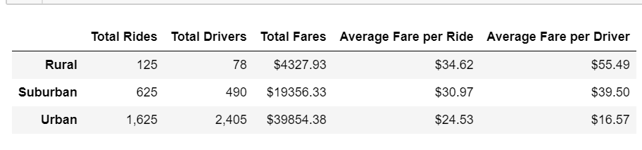
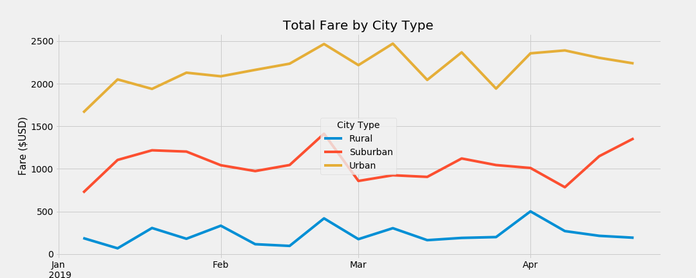

# PyBer Analysis Report

## Background and Results

### Purpose

The purpose of this analysis is to help PyBer, a ride-sharing app, identify how they can better serve, underserved neighborhoods across different city types. The findings will help improve access to ride-sharing services and determine affordability for underserved neighborhoods. 

### Resources

•	Data Source: ride_data.csv and city_data.csv.

•	Software: Python 3.7.7, Jupytor Notebook 6.0.3, Conda 4.8.3, Pandas 1.0.3 and Matplotlib 3.1.3.

### Technical Analysis

An exploratory analysis was conducted on a city and ride data (Jan-May 2019) provided by PyBer.

The ride_data.csv contained information about, city, date, fare, and ride-id and the city_data.csv contained information about, city, city type and driver count. 

After checking the two data sets for null values, they were merged to form a new dataframe (MD) for further analysis. The two deliverables created for analysis were: 

1.	A summary data-frame (SD) showcasing, total rides, total drivers, total fares, average fare per ride and average fare per driver

2.	And a multiple-line plot (MP) showcasing the sum of fares for each city type.

The values for summary data frame were calculated using pandas’ function of sum (), count () and groupby () on MD. 

The values for plotting the graph were tabulated by first, using pandas’ function of copy () on MD to create a new data frame containing only dates, fares, and city types. Then groupby() and sum() were used for tabulation. The new data frame was then converted into a pivot table. A selection of date range from Jan to April was made using pandas’ function of loc () and the data was binned into weekly bins using resample () and finally the graph was plotted using the object-oriented approach.

For detailed analysis check PyBer_Analysis.ipynb.
					
### Results

1.	SD shows that the total rides, total drivers, and total fares increase in the order of Rural, Suburban and Urban but the avg fare per ride and driver decrease in the same order. This shows that there exists an inverse relationship between the first and second set of variables.

2.	MP shows that the range for total fares across city types in as follows:
a.	Urban: 1600-2500 $
b.	Suburban: 700-1400 $
c.	Rural: 100-500 $

### Summary

The analysis shows that the total fare across different types of cities, is stable, with only slight fluctuations over the span of Jan-May 2019. It also shows that although the total fare of Rural is the least of all city types but its’ average fare per ride and driver are the highest. 

## Challenges Encountered and Overcome

### Challenges and Difficulties Encountered

**Programming**

While creating a copy of the pyberdf and adding city type and fare column to it I struggled to combine it into one step. The following code:

fare_data_df=pd.DataFrame(pyber_data_df.copy()["City Type"])
fare_data_df["Fare"]=pyber_data_df["Fare"].copy()

resulted in the desired output but I could not find a way to add both “Fare” and “City Type” column at the same time.

**Data analysis:**

1. Understanding the difference between the merge(how=left) and       merge(how=inner) and its impacts on the new data-frame formed.

2. Understanding that calculating total drivers, using the merged data-    frame, resulted in overstating the count. 

**Graphing:**

1.	Had a difficulty understanding if I required additional libraries to plot the “FiveThirtyEight” styled graph or I could just do it with matplotlib.
2.	Initially plotted it by importing seaborn.

3.	Changing the X-labels to Months when the ticks were by weeks.

4.	Adjusting grid lines and ticks to display only 3 and 4 of them, respectively.

### Technical Analyses Used

1.	Internet search of official documentation and a thorough analysis of examples provided in them. 

2.	Through trial and error and discussion with peers I figured out that by using double square brackets instead of “pd.DataFrame I could get a new dataframe with both the columns in one line:

fare_data_df = pyber_data_df[["City Type","Fare"]].copy()

3.	Inspection of Venn diagrams providing an explanation of merge(how=left) showed that the data was merged after giving priority to the data in the left frame. This resulted in the repetition of driver count in the MD and hence to get an accurate value of total drivers it had to be calculated using the city_data.csv. 

4.	In addition to official documentation a lot of queries on stack overflow and blog posts for plotting “FiveThirtyEight” style graph and trial and error approach helped resolve the issue.

## Recommendations and Next Steps

### Recommendations for Future Analysis

Using our two metrics Accessibility and Affordability some of the questions that need to be analyzed are:

**Affordability:**

The analysis brings forward the insight that further analysis is required to understand why the fare price is relatively higher in Rural areas compared to the Urban and Suburban. Is the fare price appropriately matched with the cost of living and average income of a city?
What is the average income and cost of living of a city? 
What causes the spike in fare prices in rural cities?
is the fare price high because of shortage of drivers? Further distances traveled? People spread out further and less chances of sharing a ride?

**Accessibility:**

Understanding the demand-supply equation of a city. Are the number of drivers enough or less than required? are they easily available in high-demand areas (public spaces, commercial areas etc.)? are the driver locations spread out to cover maximum service area? How easy is the app to navigate and use? Are the people aware of the PyBer ride-share facility?

### Additional Analysis 1

**Description of Approach**

We should also consider increasing the date range of the data set from 4 months to a year to get a better picture and identify if there exist a seasonal variability in fares and ride counts across city types. another “FiveThirtyEight” style plot for total rides per city types should be plotted across weakly bins. Significant spikes and variations can highlight an opportunity for increasing the driver count for that seasonal window. 

**Technical Steps**
1.	Upload an updated ride_data.csv with data for entire year and merge it with the city_data.csv.
2.	Filter the relevant columns of date, city type and ride count (using loc).
3.	Calculate the sum of ride counts using groupby and sum function.
4.	Create a pivot table with dates as index, column as city types and data as ride count.
5.	Resample into weekly bins and sum the ride count.
6.	Plot the graph using matplotlib.
7.	With sun of rides on y axis and dates (labels=months) on x-axis.

### Additional Analysis 2

**Description of Approach**
To check affordability, we need to analyze disposable income or average income across city types. We can map the incomes on a boxplot to identify median income and get an idea about our income data shape and how it is spread across cities. It will also help us identify outliers.

After the box plot analysis, we can check if income is corelated with the number of rides taken. The assumption is that the correlation between the two variables should be positive. We can map this by plotting average income and ride counts across city types.

**Technical Steps**

We will have to start by loading the csv containing income data and then merge it to the PyBer data frame (city_df +ride_df) to get a column for average income for each city.

Using groupby and mean function, we will get an average income by city type and then plot a boxplot with city types on x axis and average incomes on y axis.

To visualize the supposed correlation, we can map the two variables on a scatter plot (using matplotlib) with income on the x-axis and ride count on the y axis. To give it more depth we can plot it as a bubble chart and link the marker size with population count (will require adding population column to the dataframe).

If the assumption of positive correlation is correct, then the ride count should increase with an increase of income.

### Additional Analysis 3

**Description of Approach**

To check Accessibility, we can check correlations between city population, driver count on a scatter plot and again to add depth to the analysis we can also plot a third variable; number of rides, by using a bubble plot

**Technical Steps**

1.	Using the new dataframe created in the previous suggestion with additional columns of income and population per city type, we will make a new dataframe by filtering out city type, ride count and driver count (using loc and copy function).
2.	 Using Matplotlib a bubble plot will be created with the population per city type on the x axis, driver count per city type on the y axis and ride count per city type as the marker size.

